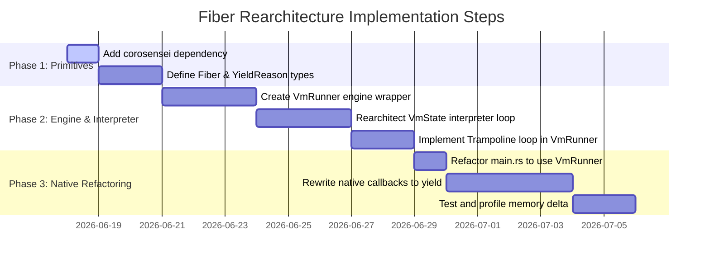

# Quoin VM: Benchmark Diagnosis, Design Explorations, and Stackful Fiber Redesign Plan

This document serves as the master design reference and implementation blueprint for the Quoin VM. It details the resolution of performance bottlenecks and compile/runtime issues, evaluates alternative VM architectures (including Continuation-Passing Style), compares low-level fiber crates, defines safety rules for integrating a tracing GC with native stackful fibers, and presents a step-by-step rearchitecture plan.

---

## 1. Executive Summary

During execution of the Quoin (Quoin) VM, two major architectural issues were identified:
1. **Garbage Collector Starvation**: Long-running native methods (such as iteration, sorting, and recursion) nested Rust's execution loop synchronously, keeping the GC heap borrowed (`mutate_root`) and preventing memory collection, causing Out-Of-Memory (OOM) crashes on large inputs.
2. **Interpreter Heap Churn**: High CPU overhead due to vector/string duplication when instantiating guest blocks.

To solve these, we have already implemented bytecode sharing optimizations (resulting in a **54% CPU reduction**) and timing harnesses that allow the GC to run periodically. To fully resolve GC starvation and lay the groundwork for guest-level concurrency, we are migrating the VM to a **stackful fiber design** driven by the `corosensei` crate.

---

## 2. Benchmark Diagnosis & Bytecode Optimization

### Fixed Issues in the Benchmark Suite
To make the benchmarks runnable and stable, several bugs in the benchmark suite and the VM native library were addressed:
* **Operator Precedence in `benchmark.qn`**: Keywords (e.g. `.value:`) have lower precedence than binary operators. The expression `.value:(n - 1) + .value:(n - 2)` was incorrectly parsed as a single nested call. We added parentheses to enforce correct evaluation: `(.value:(n - 1)) + (.value:(n - 2))`.
* **String Concatenation Type Mismatch**: Smalltalk-style string concatenation raised type errors when mixed with integers/doubles. We updated the scripts to convert primitive values using `.s` (string conversion) before concatenating.
* **Missing `at:put:` in `List`**: The `Sieve` benchmark failed when attempting to update element values in lists because the native Rust `List` implementation lacked the `at:put:` instance method. We implemented this method safely using `with_native_state_mut`.

### GC-Enabled Benchmark Timing Harness
To allow the garbage collector to run actively during benchmark execution (preventing starvation):
1. We modified `benchmark.qn` to act solely as a definition file instead of auto-executing.
2. We introduced `VmState::start_method_call` to push a method activation frame onto the stack without executing it.
3. We implemented a driving loop in `main.rs` that calls `arena.mutate_root(|mc, vm| vm.step(mc))` step-by-step and periodically triggers `arena.collect_debt()`. This separates execution steps from the borrow lifetime, enabling garbage collection during runtimes.

### Bytecode & Source Map Sharing Optimization
* **The Bottleneck**: Profiling revealed that **32.5%** of CPU time was spent cloning bytecode vectors (`Vec<Instruction>`) and source maps during guest block instantiation (`Instruction::Push(Constant::Block)`).
* **The Solution**: We introduced `SharedBytecode` and `SharedSourceMap` wrappers using `std::rc::Rc` around the vectors:
  ```rust
  #[derive(Clone, Debug, PartialEq)]
  pub struct SharedBytecode(pub std::rc::Rc<Vec<Instruction>>);

  #[derive(Clone, Debug, PartialEq)]
  pub struct SharedSourceMap(pub std::rc::Rc<Vec<Option<SourceInfo>>>);
  ```
  Both implement `gc_arena::Collect` with `NEEDS_TRACE = false` (since they do not hold GC references). Instantiating runtime blocks now performs cheap reference-count increments rather than deep allocation/cloning.

### Performance & Profiling Comparison (n=20, limit=10000, depth=10)

| Metric / Benchmark | Original Harness (No GC) | GC-Enabled Harness (Before Opt) | GC-Enabled Harness (After Opt) | Total Speedup |
|---|---|---|---|---|
| **Fibonacci** | ~14 ms | 109 ms | **63 ms** | **-42% execution time** |
| **Sieve** | ~14 ms | 156 ms | **114 ms** | **-27% execution time** |
| **Binary Trees** | OOM (>120GB) | 4,358 ms | **2,057 ms** | **-53% execution time** |
| **Total CPU Samples** | - | 9,733 (100%) | **4,479 (100%)** | **-54% CPU cycles overall** |
| **`do_collection` (GC)**| - | 2,101 (21.59%) | **580 (12.95%)** | **GC overhead cut in half** |

---

## 3. VM Architecture Design Explorations

To eliminate native blocking and allow GC collection, we analyzed three alternative VM designs before selecting stackful fibers.

### Continuation-Passing Style (CPS) Analysis
In a CPS VM, methods yield control back to the central driver (trampoline), returning a "continuation" (representing what to do next) instead of blocking the thread.
* **Does it require an Async Reactor?** **No.** A CPS VM does not need to run on an async reactor like Tokio. VM instructions are CPU-bound; running them on a task scheduler would add massive execution overhead. The core driver remains a simple synchronous trampoline loop.
* **Caveats & Migration Hurdles**:
  1. **State Machine Rewriting**: Any native method executing blocks (like `List.sort:`) must be split into a complex state machine of sequential callbacks.
  2. **Rust Lifetimes**: Closures capturing state bound to the GC lifetime `'gc` (e.g. `Box<dyn FnOnce(&mut VmState<'gc>, ...) + 'gc>`) trigger severe borrow-checker limitations.
  3. **Tracing Captured State**: Capturing variables in anonymous closures hides them from the GC tracer, requiring manual, complex implementation of `Collect` for custom state structures.

### Alternative VM Designs Evaluated

1. **Reference Counting (RC) with Cycle Detection**:
   * *Mechanism*: Replace the tracing GC (`gc_arena`) with reference-counted pointers (`Rc<RefCell<Object>>`) and a cycle collector.
   * *Pros*: Simple, standard Rust; immediate deallocation avoids GC starvation.
   * *Cons*: Requires complete rewriting of the value representation and object model; runtime overhead of ref-count updates.
2. **Fiber-Based / Stackful Coroutines (Selected)**:
   * *Mechanism*: Execute VM states on dedicated coroutine stacks. Native calls yield the entire fiber, allowing the trampoline loop to exit the GC borrow context, collect memory, and resume.
   * *Pros*: High readability (native methods remain linear); fast context switching (10-20ns).
   * *Cons*: Tracing objects held on native coroutine stacks requires careful boundary flushing.
3. **GC Safepoints**:
   * *Mechanism*: Periodically release the heap lock inside long loops or native callbacks.
   * *Pros*: Low code changes.
   * *Cons*: Restricts where safepoints can be safely called; native methods must ensure the VM state is consistent and traceable before yielding.

### Summary Comparison

| Architecture | Readability | Performance | Implementation Complexity | GC Starvation Solution |
|---|---|---|---|---|
| **Continuation-Passing (CPS)** | ❌ Low | High | ❌ Extremely High | Yes |
| **Reference Counting (RC)** | High | High | Low (Standard Rust) | Yes (Immediate) |
| **Fibers / Coroutines** | **High** | **High** | **Medium** | **Yes** |
| **GC Safepoints** | Medium | High | Medium | Yes (Interval-based) |

---

## 4. Low-Level Fiber Crate Evaluation

To implement stackful coroutines in Rust, we evaluated the leading crates for managing low-level execution context switching:

| Crate | Age & Maintenance | Open Issues | Pros | Cons |
|---|---|---|---|---|
| **`corosensei`** | Active, modern (built on stable `asm!`) | Very few (< 5) | Extremely fast (10-20ns); clean, safe API; supports modern platforms. | Stack size must be pre-allocated; stack overflow requires guard pages. |
| **`generator`** | Unmaintained (last updated years ago) | High | Built-in generator abstractions. | Uses old assembly conventions; fails to compile on modern Apple Silicon (aarch64 macOS) or Windows. |
| **`context-switch`** | Minimal maintenance | Low | Very low-level. | Lacks safe wrappers; requires writing unsafe assembly hooks manually. |
| **`fibers`** | Active, part of Erlang-like ecosystem | Medium | Production-tested in distributed systems. | Heavy, opinionated async-first runtime; designed for network I/O, not a CPU-bound VM. |

### Selection of `corosensei`
`corosensei` is the clear winner for our requirements. It provides safe wrappers around low-level stack allocation and context switching, utilizing Rust's stable inline assembly (`asm!`) rather than external linker tricks or obsolete platform-specific libraries.

### Cross-Platform Concerns & Compatibility
We must support a variety of target systems. `corosensei` fully supports:
* **macOS**: `aarch64` (Apple Silicon M1/M2/M3) and `x86_64` (Intel).
* **Linux**: `x86_64`, `aarch64`, `arm`, and `riscv64`.
* **Windows**: `x86_64` and `aarch64` (both MSVC and GNU toolchains).

On Windows, `corosensei` automatically sets up appropriate structured exception handling (SEH) tables for stack unwinding, which avoids system crashes when handling stack tracebacks or panics.

---

## 5. Integrating `gc_arena` with `corosensei` (Critical Complexity)

Integrating raw OS-level stacks (Fibers) with a tracing garbage collector (`gc_arena`) introduces a safety issue: **the stack-scanning problem**.

### ⚠️ The Stack-Scanning Problem
If a fiber is suspended, its CPU registers and native stack memory contain live references (`Value<'gc>`) pointing to the GC heap. However, `gc_arena` operates conservatively and **cannot scan the raw bytes of a `corosensei` fiber stack** during its tracing phase. 
If a GC collection runs while a fiber is suspended, any GC pointers held solely on that fiber's native stack will not be traced. The GC will sweep those objects, leaving dangling pointers and causing undefined behavior (UB).

###  The Solution: Pure Control Stacks
To make this integration 100% safe, we must ensure that **no GC pointers (`Value<'gc>` or `Gc<'gc, T>`) are held in local Rust variables across suspension boundaries** on the fiber's stack.

1. **Heap-Allocated Guest State**: All guest-level stack frames and evaluation variables must continue to reside inside the GC-rooted `VmState` struct (e.g. `vm.frames` and `vm.stack`). 
2. **Ephemeral Native Variables**: The native Rust stack of the coroutine should only contain local control variables (loops, instruction pointers) that are active during execution.
3. **Flushing before Yielding**: Whenever a fiber suspends (yields control to the scheduler), any temporary `Value<'gc>` or active registers in Rust must be flushed and written to the `VmState` before the context switch.

### 📦 Memory Management of `Coroutine` Objects
Since `corosensei::Coroutine` allocates virtual memory for its stack (using `mmap` or virtual alloc), it cannot live directly on the GC heap. 
* **Management**: We wrap the `Coroutine` in a `Box` and store it inside a native state object (`OpaqueState<Box<Coroutine>>`) on the GC heap.
* **Cleanup**: When the GC determines that a `Task` or `Fiber` object is no longer reachable, it drops the `NativeState` object. The implementation of `Drop` runs on the host thread, freeing the `Box<Coroutine>` and safely releasing the virtual stack back to the OS.

---

## 6. Safe Yielding & "Flushing before Yielding"

When a fiber yields, its execution is paused, and its stack (containing Rust local variables) is frozen in virtual memory. 

If a native method keeps a `Value<'gc>` reference *only* in a local Rust variable on that frozen stack, **the GC cannot see it**. The GC will assume the referenced object is dead, sweep it, and when the fiber resumes, that local variable will now be a dangling pointer, causing undefined behavior (UB).

**"Flushing before Yielding"** means that *before* calling `yielder.suspend()`, the native method must synchronize and write any temporary `Value<'gc>` state it needs to keep alive into a GC-visible location (like the VM's stack or the receiver's state).

### Core Rules for Native Methods:
1. **Never hold a `Vec<Value<'gc>>` on the Rust stack across a suspend point.** Store it back in the list/object state, or push the elements onto the VM's GC-rooted evaluation stack.
2. **Never keep temporary `Value<'gc>` registers in local variables.** Always store them in `vm.stack` or `vm.registers` (which are rooted in `VmState` and fully traced).
3. **Rust stack must be stateless regarding GC references during yield**: Treat the fiber's native stack as an "ephemeral pipeline"—it performs operations on GC objects, but must not be the *exclusive* holder of any GC references when suspended.

### Code Example: Implementing a Custom sorting method (`List.sort:`)

Consider a native `sort:` method. It reads a list, sorts it using a comparison block, and needs to yield to the VM to run that comparison block.

#### ❌ The Wrong Way (No Flushing)
If we yield directly, the vector we are sorting is frozen as a local variable on the fiber stack. During the yield, a GC pass may sweep the elements of the vector:

```rust
.instance_method("sort:", |vm, mc, args| {
    let yielder = vm.get_yielder(); // imaginary yielder getter
    let mut vec: Vec<Value<'gc>> = args[0].get_vec().to_vec(); 

    // Bubble sort loop
    for i in 0..vec.len() {
        for j in 0..vec.len() - 1 {
            // We need the VM to evaluate the comparator block
            // ❌ WRONG: 'vec' is held only in this local variable on the stack!
            let res = yielder.suspend(YieldReason::CallBlock { 
                block: args[1], 
                args: vec![vec[j], vec[j + 1]] 
            });
            // If the GC ran during suspension, elements in 'vec' may be corrupted here!
            if !res.is_true() {
                vec.swap(j, j + 1);
            }
        }
    }
    Ok(args[0])
})
```

####  The Right Way (Flushing before Yielding)
Before calling `yielder.suspend`, we "flush" the sorting vector back into the receiver list's state (which is a GC-tracked object). Upon resuming, we re-acquire it:

```rust
.instance_method("sort:", |vm, mc, args| {
    let yielder = vm.get_yielder();
    
    // Bubble sort loop
    let len = args[0].with_native_state(|l: &NativeListState| l.get_vec().len())?;
    for i in 0..len {
        for j in 0..len - 1 {
            // 1. Fetch values safely from the GC-tracked list
            let (val_a, val_b) = args[0].with_native_state(|l| (l.get_vec()[j], l.get_vec()[j + 1]))?;
            
            // 2. Perform the yield.
            // Since we don't hold any temporary vec on our Rust stack, GC can run safely!
            let res = yielder.suspend(YieldReason::CallBlock { 
                block: args[1], 
                args: vec![val_a, val_b] 
            });
            
            // 3. Process result and update the GC-tracked list state
            if !res.is_true() {
                args[0].with_native_state_mut(mc, |l| {
                    l.get_vec_mut().swap(j, j + 1);
                })?;
            }
        }
    }
    Ok(args[0])
})
```

---

## 7. Exposing Concurrency to Guest Code (Fibers & Generators)

Exposing stackful coroutines to guest code allows us to implement cooperative green threads and generator classes natively in Quoin.

### Cooperative Green Threads
We can introduce a `Task` class to guest code:
```smalltalk
task = Task.new: {
    1 to: 5 do: { |i|
        .print: i.
        Task.yield. "* Yields control to scheduler"
    }
}.
task.start.
```
* **Under the Hood**:
  1. `Task.new:` instantiates a new `Task` object, allocating a fresh `corosensei::Coroutine`.
  2. The scheduler appends the new task to its run queue.
  3. When `Task.yield` is called, the fiber suspends itself with a `YieldReason::CooperativeYield`, allowing the scheduler to run other tasks.

### Generators (Iterators)
We can expose a `Generator` class:
```smalltalk
gen = Generator.new: { |g|
    g.yield: 1.
    g.yield: 2.
}.
.print: gen.next. "* 1"
```
* **Under the Hood**:
  1. `Generator` allocates a dedicated fiber.
  2. When `g.yield: val` is called, the fiber suspends itself with `YieldReason::YieldValue(val)`.
  3. The caller receives `val` and the generator fiber remains suspended until `.next` is called again.

---

## 8. Simplifying `src/main.rs` with `VmRunner`

To keep `src/main.rs` clean and readable, all VM engine bootstrap processes (GC arena creation, built-in registrations, and the execution loop) will be encapsulated into a `VmRunner` structure in `src/runner.rs`.

### The `VmRunner` Interface
```rust
pub struct VmOptions {
    pub file_path: Option<String>,
    pub run_benchmark: bool,
    pub run_tests: bool,
}

pub struct VmRunner {
    options: VmOptions,
}

impl VmRunner {
    pub fn new(options: VmOptions) -> Self {
        Self { options }
    }

    /// Entry point for running parsed CLI commands
    pub fn run(&self) -> Result<(), QuoinError> {
        // ...
    }

    /// Triggers the VM trampoline loop using gc_arena
    fn run_trampoline(&self, ast_nodes: Vec<Node>) -> Result<Value<'gc>, QuoinError> {
        // ...
    }
}
```

### Refactored `src/main.rs`
```rust
use quoin::runner::{VmRunner, VmOptions};

fn main() {
    let args: Vec<String> = std::env::args().collect();
    let options = VmOptions::parse(&args);
    let runner = VmRunner::new(options);

    if let Err(e) = runner.run() {
        eprintln!("Execution error: {:?}", e);
        std::process::exit(1);
    }
}
```

---

## 9. Step-by-Step Implementation Plan



### Phase 1: Define Primitives & Dependencies
1. Add `corosensei = "0.1"` (or latest version) to `Cargo.toml`.
2. Define the yield reasons inside `src/instruction.rs` or `src/vm.rs`:
   ```rust
   pub enum YieldReason<'gc> {
       CallBlock { block: Gc<'gc, Block<'gc>>, args: Vec<Value<'gc>> },
       CooperativeYield,
       Return(Value<'gc>),
   }
   ```
3. Create a wrapper representation for `corosensei::Coroutine` that safely implements `gc_arena::Collect` (marking elements but ignoring the internal pointer address, clean up on drop).

### Phase 2: Core Loop & Engine
1. Move built-in class registrations (`List`, `Timer`, `Block`, etc.) from `main.rs` into `runner.rs`.
2. Modify `VmState::step` inside `src/vm.rs` to accept the `corosensei::Yielder` token and yield control instead of executing nested loops.
3. Implement the main trampoline runner loop inside `VmRunner::run_trampoline`, calling `corosensei::Coroutine::resume` and catching `YieldReason` payloads. Periodically invoke GC collection outside the coroutine runs.

### Phase 3: Native Methods & Validation
1. Refactor `main.rs` to be a minimal CLI delegator.
2. Rewrite native block calls (such as in `List.sort:`, `Timer.time:`, and iterator methods) to yield their block parameters via `YieldReason::CallBlock` rather than running them synchronously.
3. Validate correctness by executing tests and profiling heap memory depth with `samply` to confirm GC is active and garbage starvation is completely eliminated.
